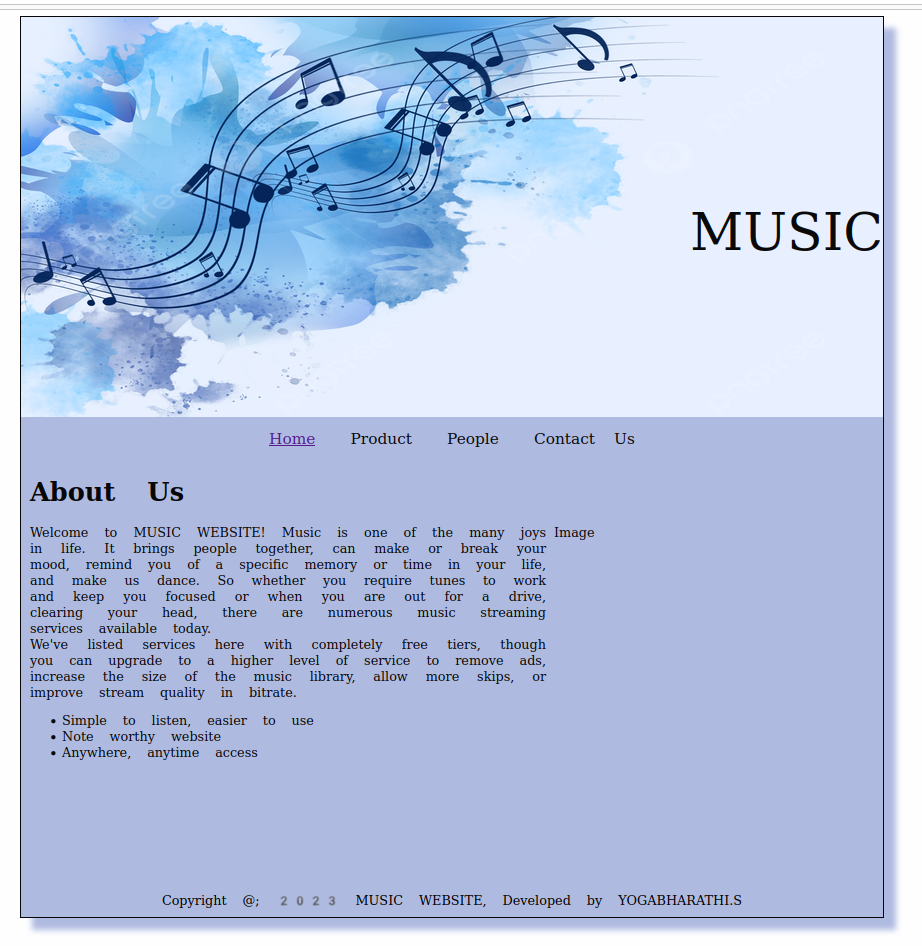
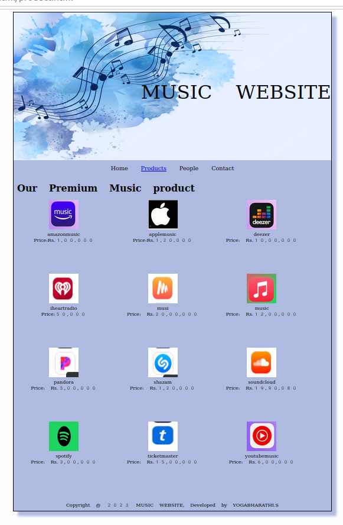
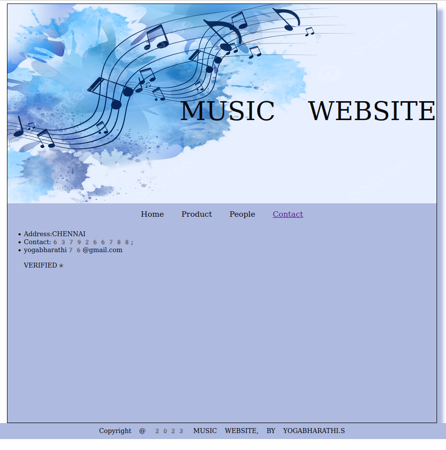

# Web Design for a Software Product Company

## AIM:

To design a static website for a software product company company.

## DESIGN STEPS:

### Step 1:

Requirement collection.

### Step 2:

Creating the layout using HTML and CSS.

### Step 3:

Updating the sample content.

### Step 4:

Choose the appropriate style and color scheme.

### Step 5:

Validate the layout in various browsers.

### Step 6:

Validate the HTML code.

### Step 6:

Publish the website in the given URL.

## PROGRAM :
### Home Page:
```
<!DOCTYPE html>
<html lang="en">
  <head>
    <title>MUSIC WEBSITE</title>
    <link rel="stylesheet" href="../css/layout.css" />
    <link rel="icon" href="./img/background.png" type="image/x-icon" />
  </head>

  <body>
    <div class="container">
      <div class="banner">MUSIC</div>
      <div class="menu">
        <div class="menuitemselected"><a href="/static/home.html">Home</a></div>
        <div class="menuitem"><a href="/static/products.html">Product</a></div>
        <div class="menuitem"><a href="/static/people.html">People</a></div>
        <div class="menuitem"><a href="/static/contact us.html">Contact Us</a></div>
      </div>
      <div class="content">
        <div class="homecontent">
          <h1>About Us</h1>
          
          <div class="contenttext">
            Welcome to MUSIC WEBSITE!
            Music is one of the many joys in life. It brings people together, 
            can make or break your mood, 
            remind you of a specific memory or time in your life, and make us dance.
            So whether you require tunes to work and keep you focused or when you are out for a drive,
            clearing your head, there are numerous music streaming services available today. 
            <br />
            We've listed services here with completely free tiers, 
            though you can upgrade to a higher level of service to remove ads,
            increase the size of the music library, allow more skips, or improve stream quality in bitrate. 
           
            <ul>
              <li>Simple to listen, easier to use</li>
              <li>Note worthy website</li>
              <li>Anywhere, anytime access</li>
            </ul>
          </div>
        </div>
      </div>
      <div class="footer">
        Copyright @; 2023 MUSIC WEBSITE, Developed by YOGABHARATHI.S
      </div>
    </div>
  </body>
</html>
```
### Product Page:
```
<!DOCTYPE html>
<html lang="en">
  <head>
    <title>MUSIC WEBSITE</title>
    <link rel="stylesheet" href="../css/layout.css" />
    <link rel="icon" href="./img/background.png" type="image/x-icon" />
  </head>

  <body>
    <div class="container">
      <div class="banner">MUSIC WEBSITE</div>
      <div class="menu">
        <div class="menuitem"><a href="/static/home.html">Home</a></div>
        <div class="menuitemselected"><a href="/static/product.html">Products</a></div>  
        <div class="menuitem"><a href="/static/people.html">People</a></div>
        <div class="menuitem"><a href="/static/contact.html">Contact</a></div>
      </div>
      <div class="content">
        <div class="productcontent">    
          <h1>Our Premium Music product</h1>
          <div class="productitems">

              <div class="productitem"> 
                  <div class="itemimage">
                  
                  </div>
                  <div class="itemname">amazonmusic</div>
                  <div class="itemprice">Price:Rs.1,00,000</div>
              </div>

              <div class="productitem"> 
                  <div class="itemimage">
                  
                  </div>
                  <div class="itemname">applemusic</div>
                  <div class="itemprice">Price:Rs.1,20,000</div>
              </div>

              <div class="productitem"> 
                  <div class="itemimage">
                  
                  </div>
                  <div class="itemname">deezer</div>
                  <div class="itemprice">Price: Rs.10,00,000</div>
              </div>

              <div class="productitem"> 
                <div class="itemimage">
                
                </div>
                <div class="itemname">iheartradio</div>
                <div class="itemprice">Price:50,000 </div>
            </div>

            <div class="productitem"> 
              <div class="itemimage">
              
              </div>
              <div class="itemname">musi</div>
              <div class="itemprice">Price: Rs.20,00,000</div>
          </div>

          <div class="productitem"> 
            <div class="itemimage">
            
            </div>
            <div class="itemname">music</div>
            <div class="itemprice">Price: Rs.12,00,000 </div>
        </div>

        <div class="productitem"> 
          <div class="itemimage">
          
          </div>
          <div class="itemname">pandora</div>
          <div class="itemprice">Price: Rs.5,00,000</div>
      </div>

      <div class="productitem"> 
        <div class="itemimage">
        
        </div>
        <div class="itemname">shazam</div>
        <div class="itemprice">Price: Rs.1,20,000 </div>
    </div>

    <div class="productitem"> 
      <div class="itemimage">
      
      </div>
      <div class="itemname">soundcloud</div>
      <div class="itemprice">Price: Rs.19,90,080</div>
    </div>

    <div class="productitem"> 
       <div class="itemimage">
       
       </div>
       <div class="itemname">spotify</div>
       <div class="itemprice">Price: Rs.3,00,000 </div>
    </div>
    <div class="productitem"> 
      <div class="itemimage">
      
    </div>
       <div class="itemname">ticketmaster</div>
       <div class="itemprice">Price: Rs.15,00,000</div>
    </div>

    <div class="productitem"> 
      <div class="itemimage">
      
     </div>
        <div class="itemname">youtubemusic</div>
        <div class="itemprice">Price: Rs.6,00,000 </div>
      </div>
    </div>
  </div>        
  </div>
    <div class="footer">
      Copyright @ 2023 MUSIC WEBSITE, Developed by YOGABHARATHI.S
    </div>
  </div>
 </body>
</html>
```
### People Page:
```
<!DOCTYPE html>
<html lang="en">
  <head>
    <title>MUSIC WEBSITE</title>
    <link rel="stylesheet" href="../css/layout.css"/>
    <link rel="icon" href="./img/background.png" type="image/x-icon" />
  </head>

  <body>
    <div class="container">
      <div class="banner">MUSIC WEBSITE</div>
      <div class="menu">
        <div class="menuitem"><a href="/static/home.html">Home</a></div>
        <div class="menuitem"><a href="/static/products.html">Product</a></div>  
        <div class="menuitemselected"><a href ="/static/people.html"></a>People</a></div>
        <div class="menuitem"><a href="/static/contact.html">Contact</a></div>
      </div>
      <div class="productitem"> 
        <div class="itemimage">
        
      </div>
         <div class="itemname">Singer
           <br>
           (Anirudh)
         </div>
      </div>
      <div class="productitem"> 
        <div class="itemimage">
        
      </div>
         <div class="itemname">Singer
           <br>
           (Chitra)
         </div>
      </div>
      <div class="productitem"> 
        <div class="itemimage">
        
      </div>
         <div class="itemname">Singer <br>(A.R.Rahman)</div>
      </div>
      <div class="productitem"> 
        <div class="itemimage">
        
      </div>
         <div class="itemname">Singer <br> (Yuvan Shankar Raja)</div>
      </div>
      <div class="productitem"> 
        <div class="itemimage">
        
      </div>
         <div class="itemname">Singer <br>(Pradeep Kumar)</div>
      </div>
      <div class="productitem"> 
        <div class="itemimage">
        
      </div>
         <div class="itemname">Singer <br> (S.B.Balasubrahmanyam)</div>
      </div>
      <div class="footer">
        Copyright @ 2023 MUSIC WEBSITE, Developed by YOGABHARTHI.S
      </div>
    </div>
  </body>
</html>
```
### Contact Page:
```
<!DOCTYPE html>
<html lang="en">
  <head>
    <title>MUSIC WEBSITE</title>
    <link rel="stylesheet" href="../css/layout.css" />
    <link rel="icon" href="/static/img/background.png" type="image/x-icon" />
  </head>

  <body>
    <div class="container">
      <div class="banner">MUSIC WEBSITE</div>
      <div class="menu">
        <div class="menuitem"><a href="/static/home.html">Home</a></div>
        <div class="menuitem"><a href="/static/product.html">Product</a></div>
        <div class="menuitem"><a href="/static/people.html">People</a></div>
        <div class="menuitemselected"><a href="/static/contact.html">Contact</a></div>
      </div>
      <div class="content">
          <ul>
              <li>Address:CHENNAI<br></li>
              <li>Contact:6379266788;<br></li>
              <li>yogabharathi76@gmail.com<br></li>
              <br>VERIFIED*
          </ul>    
        </div>
    </div>
    </div>
    </div>
      <div class="footer">
        Copyright @ 2023 MUSIC WEBSITE, BY YOGABHARATHI.S
      </div>
    </div>
  </body>
</html> 
```
### Layout CSS:
```
* {
  box-sizing: border-box;
  font-family:emoji;
}
body {
  background-color: #fefeff;
  color: #070707;
}
.container {
  width: 1080px;
  margin-left: auto;
  margin-right: auto;
  border-width: 1px 1px 1px 1px;
  border-style: solid;
  box-shadow: 15px 15px 8px #afbae0;
}

.banner {
  display: block;
  width: 100%;
  height: 500px;
  text-align: right;
  font-size: 65px;
  background-image: url("/static/img/background.png");
  background-size: 100% 100%;
  margin: 0px 0px 0px 0px;
  padding-top: 230px;
  color: #0a090a;
}

.menu {
  display: block;
  width: 100%;
  height: 50px;
  font-size: larger;
  background-color: #afbae0;
  text-align: center;
  padding-top: 15px;
  margin: 0px 0px 0px 0px;
  border-width: 1px;
}

.menuitem {
  display: inline-block;
  margin-left: 10px;
  margin-right: 10px;
}
.menuitemselected {
  display: inline-block;
  margin-left: 10px;
  margin-right: 10px;
  color: #080808;
}

.menuitem a {
  text-decoration: none;
  color: #080808;
}

.content {
  display: block;
  width: 100%;
  background-color: #afbae0;
  min-height: 500px;
  margin: 0px 0px 0px 0px;
  border-width: 1px;
  border-color: #afbae0;
  border-style: solid;
}
.homecontent {
  min-height: 500px;
  margin: 10px 10px 10px 10px;
}
.homecontent h1 {
  text-align: left;
}
.homecontent img {
  float: right;
  width: 400px;
  height: 300px;
  margin-left: 10px;
}

.contenttext {
  text-align: justify;
}

.productcontent {
  min-height: 500px;
  margin: 10px 10px 10px 10px;
}

.productcontent h1 {
  text-align: left;
}

.productitems {
  display: block;
}

.productitem {
  display: inline-block;
  width: 30%;
  height: 250px;
  text-align: center;
}

.productitem img {
  width: 100px;
  height: 100px;
  display: block;
}
.productitem .itemimage {
  display: block;
  margin-left: auto;
  margin-right: auto;
  width: 100px;
  margin-bottom: 5px;
}

.productitem .itemname {
  display: block;
}
.productitem .itemprice {
  display: block;
}

.footer {
  display: block;
  width: 100%;
  height: 40px;
  background-color: #afbae0;
  text-align: center;
  padding-top: 10px;
  margin: 0px 0px 0px 0px;
  color: #000000;
}
```
## OUTPUT:

### Home Page:

### Product Page:

### People Page:

### Contact Page:


## Result:

Thus a website is designed for the software product company and the HTML,CSS code are validated.
